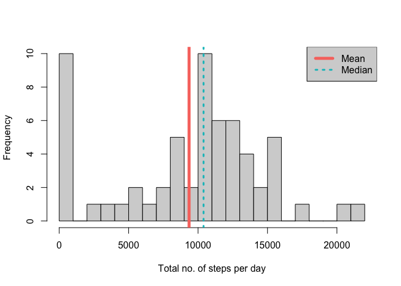
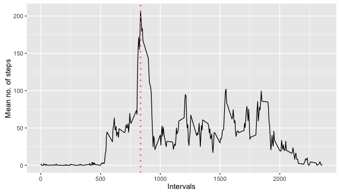
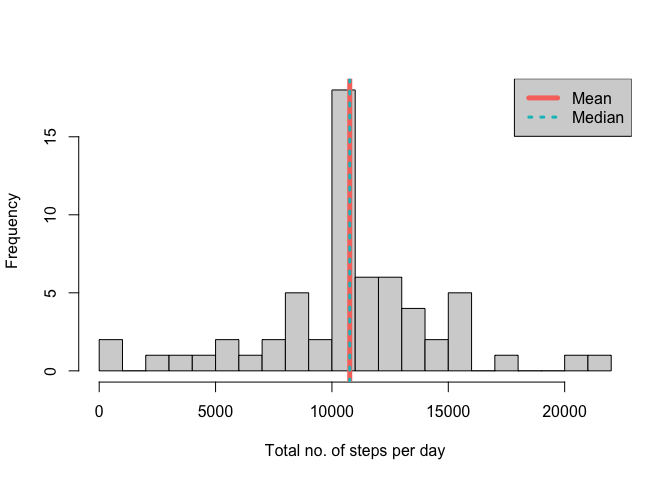
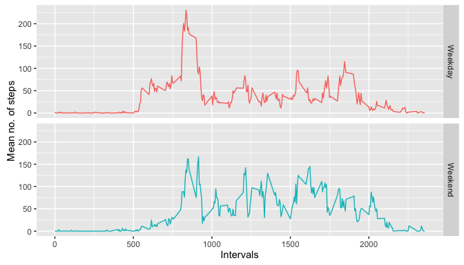

# Reproducible Research Assignment: Course Project 1
## Loading and preprocessing the data

1. Load the data
2. Process/transform the data (if necessary) into a format suitable for your analysis

```r
# Clear all environment data
rm(list = ls())
# Initate colors to be used
colors <- c("#F8766D", "#00BFC4") # traced from ggplot2
# Load the activity data, (extracted from activity.zip)
activity <- read.csv(unz("activity.zip","activity.csv"))
```


## What is mean total number of steps taken per day?

1. Calculate the total number of steps taken per day
2. Make a histogram of the total number of steps taken each day
3. Calculate and report the mean and median of the total number of steps taken per day

Computing the total no. of steps per day ignoring the missing values:


```r
library(plyr)
totalStepsPerDay <- ddply(activity, .(date) , summarize
                        , steps = sum(steps, na.rm = TRUE))
```

Calculating the mean and median of the total no. of steps per day -- the _6 summary values_ is included to cross-check with the computed mean and median values:


```r
mean_sum_daily_steps <- mean(totalStepsPerDay$steps)
median_sum_daily_steps <- median(totalStepsPerDay$steps)
# Show the 6 summary values for cross-checking
summary(totalStepsPerDay)
```

```
##          date        steps      
##  2012-10-01: 1   Min.   :    0  
##  2012-10-02: 1   1st Qu.: 6778  
##  2012-10-03: 1   Median :10395  
##  2012-10-04: 1   Mean   : 9354  
##  2012-10-05: 1   3rd Qu.:12811  
##  2012-10-06: 1   Max.   :21194  
##  (Other)   :55
```

Below is the histogram of sum of steps per day excluding missing values.  Mean and median values are also reflected: 


```r
hist(totalStepsPerDay$steps, breaks = 20, 
        xlab = "Total no. of steps per day", main = "", col = "lightgray")
abline(v = mean_sum_daily_steps, col = colors[1], lwd = 5)
abline(v = median_sum_daily_steps, col = colors[2], lty = "dotted", lwd = 3)
legend("topright", c("Mean", "Median"), col = c(colors[1], colors[2]), 
        lwd = c(5, 3), lty = c("solid", "dotted"), bg = "lightgray")
```

<!-- -->

The mean total number of steps taken per day is __9,354.23__, while the median total number of steps taken per day is __10,395__.


## What is the average daily activity pattern?

1. Make a time series plot (i.e. type = "l") of the 5-minute interval (x-axis) and the average number of steps taken, averaged across all days (y-axis)
2. Which 5-minute interval, on average across all the days in the dataset, contains the maximum number of steps?

```r
# Compute for average steps per interval
meanStepsPerInterval <- ddply(activity, .(interval) , summarize
                        , meanSteps = mean(steps, na.rm = TRUE))
# Find the interval with maximum steps from dataset
which_interval <- meanStepsPerInterval[
                        which.max(meanStepsPerInterval$meanSteps),]$interval
# Plot the time-series of the 5-minute interval (x-axis) and the average 
# number of steps taken, averaged across all days (y-axis)
library(ggplot2)
ggplot(meanStepsPerInterval, aes(interval, meanSteps)) + 
        geom_line() +
        geom_vline(xintercept = which_interval, linetype = "dotted", 
                col = colors[1], size = 1) + 
        xlab("Intervals") +
        ylab("Mean no. of steps") 
```

<!-- -->

On average across all the days in the dataset, interval __835__ contains the maximum number of steps.

## Imputing missing values

Note that there are a number of days/intervals where there are missing values (coded as _NAs_). The presence of missing days may introduce bias into some calculations or summaries of the data.

1. Calculate and report the total number of missing values in the dataset (i.e. the total number of rows with NAs)

This can be referenced from the "6 summary values" of the _steps_ variable below, but this can also be calculated as the sum of NA's as follows:


```r
summary(activity)
```

```
##      steps                date          interval     
##  Min.   :  0.00   2012-10-01:  288   Min.   :   0.0  
##  1st Qu.:  0.00   2012-10-02:  288   1st Qu.: 588.8  
##  Median :  0.00   2012-10-03:  288   Median :1177.5  
##  Mean   : 37.38   2012-10-04:  288   Mean   :1177.5  
##  3rd Qu.: 12.00   2012-10-05:  288   3rd Qu.:1766.2  
##  Max.   :806.00   2012-10-06:  288   Max.   :2355.0  
##  NA's   :2304     (Other)   :15840
```

```r
missing_val <- is.na(activity$steps)
table(missing_val) # TRUE
```

```
## missing_val
## FALSE  TRUE 
## 15264  2304
```
The total number of missing values is __2,304__.

2. Devise a strategy for filling in all of the missing values in the dataset. The strategy does not need to be sophisticated. For example, you could use the mean/median for that day, or the mean for that 5-minute interval, etc.

The mean steps for that 5-minute interval will be used to fill in all the missing values depending on the _interval_ varibale.  The activity dataframe is then mutated by adding a new variable _newStep_, assigning with the _meanStepsPerInterval$meanSteps_ (refer to the next section for the implementation).

3. Create a new dataset that is equal to the original dataset but with the missing data filled in.


```r
# [Left outer] joining the activity data and the meanStepsPerInterval 
# by interval variable to fill in missing values
activity <- merge(activity, meanStepsPerInterval, by="interval", all.x = TRUE)
# Create a new variable "newSteps" to replace steps having NA values 
# with the mean steps per interval  
activity <- mutate(activity, newSteps = ifelse(is.na(steps), meanSteps, steps))
# activity <- activity[order(activity$date, activity$interval),]
# Recompute the total no. of [new value of] steps per day:
totalStepsPerDay <- ddply(activity, .(date) , summarize
                        , newSteps = sum(newSteps))
# The above computation is equivalent to below
# totalStepsPerDay2 <- aggregate(newSteps ~ date, data = activity, sum)
```

4. Make a histogram of the total number of steps taken each day and Calculate and report the mean and median total number of steps taken per day. Do these values differ from the estimates from the first part of the assignment? What is the impact of imputing missing data on the estimates of the total daily number of steps?

Below is the histogram of sum of steps per day with imputed missing values.  Mean and median values are also reflected:


```r
# Recompute the mean and median of the total no. of steps per day.  
mean_sum_daily_steps <- mean(totalStepsPerDay$newSteps)
median_sum_daily_steps <- median(totalStepsPerDay$newSteps)
# Plotting the histogram of sum of steps per day with imputed values.  
hist(totalStepsPerDay$newSteps, breaks = 20, 
        xlab = "Total no. of steps per day", main = "", col = "lightgray")
abline(v = mean_sum_daily_steps, col = colors[1], lwd = 5)
abline(v = median_sum_daily_steps, col = colors[2], lty = "dotted", lwd = 3)
legend("topright", c("Mean", "Median"), col = c(colors[1], colors[2]), 
        lwd = c(5, 3), lty = c("solid", "dotted"), bg = "lightgray")
```

<!-- -->

After the missing values were imputed, the new mean total number of steps taken per day is __10,766.19__, while the new median total number of steps taken per day is __10,766.19__.  Both values increased significantly, although they have the same value after filling in missing values with the mean value with the respective interval.


## Are there differences in activity patterns between weekdays and weekends?

1. Create a new factor variable in the dataset with two levels -- "weekday" and "weekend" indicating whether a given date is a weekday or weekend day.


```r
# Add a new variable "weekPart" to classify a corresponding date as either 
# "weekend" or "weekday"
activity <- mutate(activity, 
                weekPart = as.factor(ifelse(weekdays(as.Date(date)) %in%
                        c("Saturday", "Sunday"), "Weekend", "Weekday")))
# Compute for average steps (using the imputed values) per interval 
# and week part.  The dataset with the filled-in missing value is used.
meanStepsPerInterval <- ddply(activity, .(interval, weekPart) , summarize
                        , steps = mean(newSteps))
```

2. Make a panel plot containing a time series plot (i.e. type = "l") of the 5-minute interval (x-axis) and the average number of steps taken, averaged across all weekday days or weekend days (y-axis). 


```r
# Plot the time-series of the 5-minute interval (x-axis) and the average 
# number of steps taken, averaged across all days (y-axis) with week part
ggplot(meanStepsPerInterval, aes(interval, steps, col = weekPart)) + 
        facet_grid(weekPart ~ .) + 
        geom_line() +
        # remove the legend caused by weekPart colors
        theme(legend.position = "none") + 
        xlab("Intervals") +
        ylab("Mean no. of steps") 
```

<!-- -->


